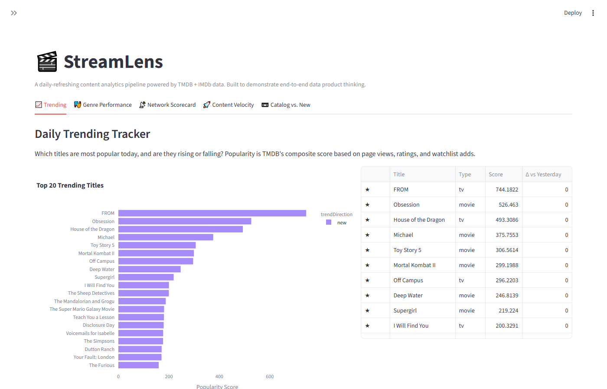
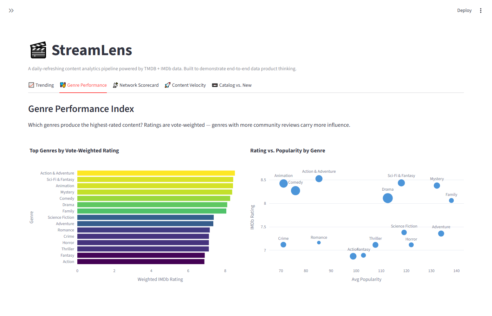
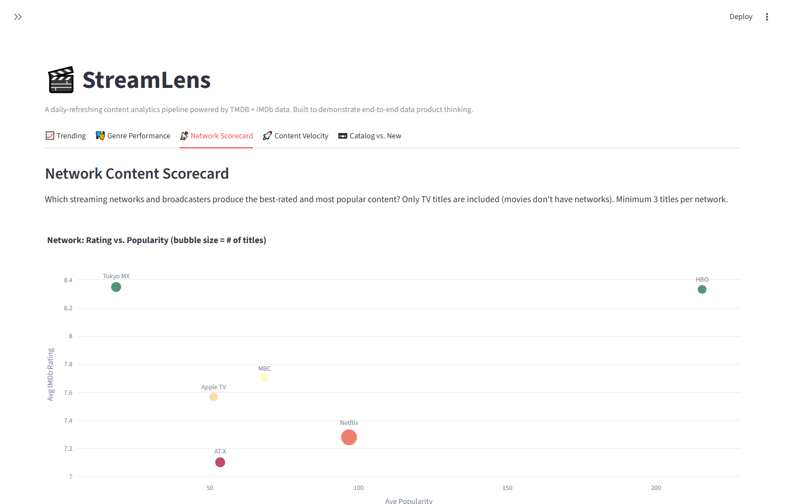
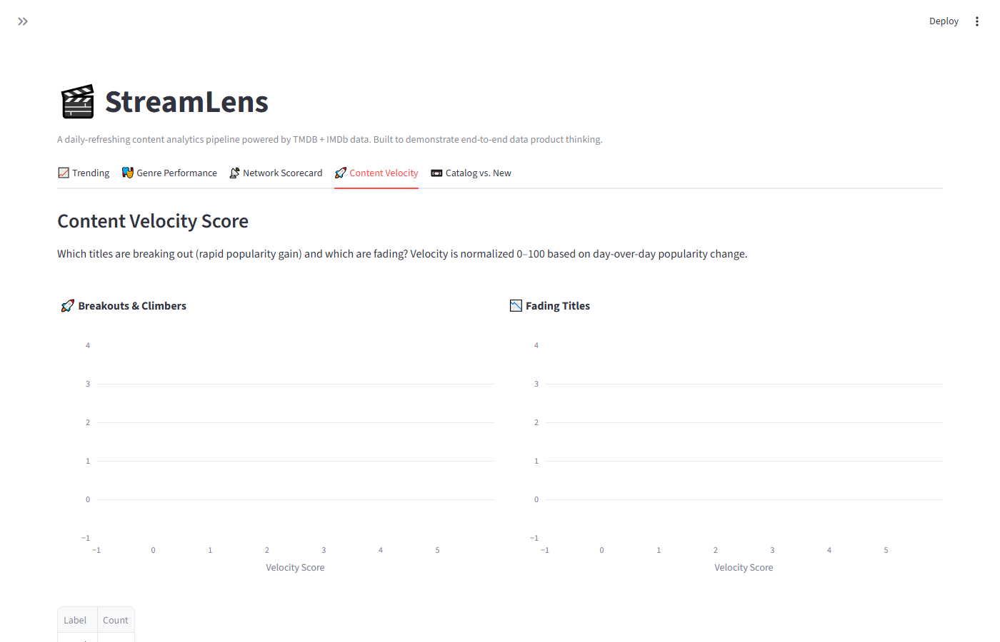
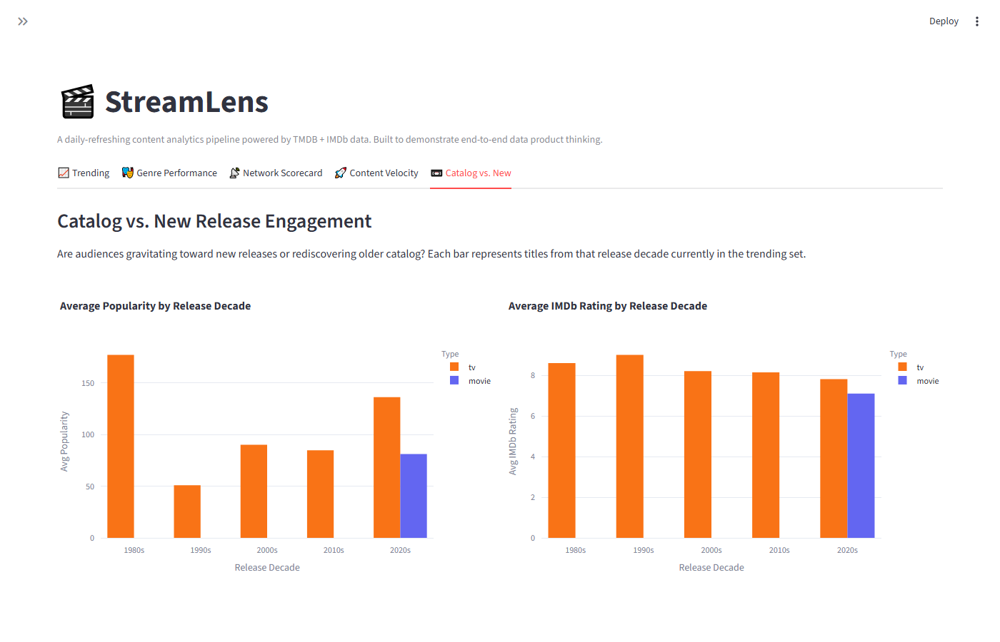

# StreamLens

**A daily-refreshing content analytics pipeline for streaming data.**

StreamLens answers the questions a streaming product team asks every morning:

- Which titles are trending right now — and are they rising or falling?
- Which genres are producing the highest-quality content?
- Which networks lead on ratings and audience engagement?
- Which titles are breaking out versus losing momentum?
- Are audiences gravitating toward new releases or rediscovering the catalog?

The pipeline ingests data from [TMDB](https://www.themoviedb.org/) and [IMDb](https://developer.imdb.com/non-commercial-datasets/), transforms it through a three-layer architecture, and surfaces the results in a live dashboard. It runs automatically every day via GitHub Actions.

**[View the live dashboard →](https://streamlensbrandon.streamlit.app/)**

---

## Dashboard

**[streamlensbrandon.streamlit.app](https://streamlensbrandon.streamlit.app/)** — updates automatically every morning with fresh data.

| | |
|---|---|
|  |  |
| **Trending Tracker** — top titles by popularity with rise/fall indicators | **Genre Performance** — vote-weighted IMDb ratings by genre |
|  |  |
| **Network Scorecard** — best-rated streaming networks | **Content Velocity** — breakout and fading titles |
|  | |
| **Catalog vs. New** — popularity and ratings by release decade | |

---

## How it works

```
┌─────────────────────────────────────────────────────────────┐
│                     DATA SOURCES                            │
│                                                             │
│  TMDB API (live)          IMDb Datasets (daily download)    │
│  • Trending titles        • Title metadata                  │
│  • Title details          • Ratings & vote counts           │
│  • Genres & networks                                        │
└───────────────┬─────────────────────────┬───────────────────┘
                │                         │
                ▼                         ▼
┌─────────────────────────────────────────────────────────────┐
│  BRONZE LAYER  — raw data stored as received                │
│  Every record timestamped. Nothing is modified or deleted.  │
└─────────────────────────────┬───────────────────────────────┘
                              │
                              ▼
┌─────────────────────────────────────────────────────────────┐
│  SILVER LAYER  — cleaned, validated, joined                 │
│  TMDB + IMDb merged on shared ID. Types cast. Deduped.      │
└─────────────────────────────┬───────────────────────────────┘
                              │
                              ▼
┌─────────────────────────────────────────────────────────────┐
│  GOLD LAYER  — business metrics                             │
│  Trending Tracker  •  Genre Performance  •  Network Score   │
│  Content Velocity  •  Catalog Engagement                    │
└─────────────────────────────┬───────────────────────────────┘
                              │
                              ▼
                    ┌─────────────────────────────┐
                    │   Live Dashboard            │
                    │   streamlensbrandon         │
                    │   .streamlit.app            │
                    └─────────────────────────────┘
```

All data lives in a single [DuckDB](https://duckdb.org/) file — a fast, serverless analytical database that requires no installation or configuration beyond the Python package. The Gold layer is exported to parquet daily and served via [Streamlit Community Cloud](https://streamlensbrandon.streamlit.app/).

---

## Quickstart

### 1. Prerequisites

- Python 3.12+
- [uv](https://docs.astral.sh/uv/) (package manager)
- A free TMDB API key — [get one here](https://www.themoviedb.org/settings/api) (takes ~2 minutes)

### 2. Clone and install

```bash
git clone https://github.com/brandon728/StreamLens.git
cd StreamLens
uv sync
```

### 3. Add your API key

Create a `.env` file in the project root:

```
TMDB_API_KEY=your_api_key_here
```

### 4. Run the pipeline

```bash
uv run python -m streamlens.pipeline
```

This will:
- Fetch today's trending titles from TMDB (~100 titles)
- Download today's IMDb dataset snapshot (~100MB, cached after first run)
- Write all data to `data/streamlens.duckdb` and export Gold tables to `data/gold/`

First run takes 3–5 minutes (IMDb download). Subsequent runs are ~30 seconds.

### 5. Launch the dashboard locally

```bash
uv run streamlit run dashboard/app.py
```

Open [http://localhost:8501](http://localhost:8501) in your browser. Or visit the hosted version at [streamlensbrandon.streamlit.app](https://streamlensbrandon.streamlit.app/).

### 6. Run the tests

```bash
uv run pytest tests/ -v
```

---

## Project structure

```
StreamLens/
├── src/streamlens/
│   ├── database.py          # Database setup and schema definitions
│   ├── pipeline.py          # End-to-end pipeline orchestrator
│   ├── ingest/
│   │   ├── tmdbClient.py    # TMDB API client
│   │   └── imdbLoader.py    # IMDb dataset downloader
│   └── transform/
│       ├── bronze.py        # Raw ingestion layer
│       ├── silver.py        # Cleaning and joining layer
│       └── gold.py          # Business metrics layer + parquet export
├── dashboard/
│   └── app.py               # Streamlit dashboard
├── data/gold/               # Parquet exports for the hosted dashboard
├── tests/                   # Unit tests
├── docs/
│   └── data_dictionary.md   # Plain-English field definitions
├── requirements.txt         # Streamlit Cloud dependencies
└── .github/workflows/
    └── pipeline.yml         # Daily pipeline + parquet commit
```

---

## Metrics reference

| Metric | Question answered | Table |
|--------|-------------------|-------|
| Trending Tracker | What's popular today and is it rising or falling? | `gold_trending_tracker` |
| Genre Performance | Which genres produce the best-rated content? | `gold_genre_performance` |
| Network Scorecard | Which networks lead on quality and engagement? | `gold_network_scorecard` |
| Content Velocity | Which titles are breaking out vs. fading? | `gold_content_velocity` |
| Catalog Engagement | Are audiences rewatching older titles? | `gold_catalog_engagement` |

Full field definitions → [docs/data_dictionary.md](docs/data_dictionary.md)

---

## Data sources

| Source | Type | Refresh | License |
|--------|------|---------|---------|
| [TMDB API](https://www.themoviedb.org/) | REST API | Live | Free, non-commercial |
| [IMDb Non-Commercial Datasets](https://developer.imdb.com/non-commercial-datasets/) | Bulk TSV files | Daily | Free, non-commercial |

---

## Automated refresh

The pipeline runs automatically every day at 06:00 UTC via GitHub Actions. Fresh data is committed back to the repo and the [live dashboard](https://streamlensbrandon.streamlit.app/) redeploys automatically.

To run this on your own fork:

1. Go to **Settings → Secrets and variables → Actions**
2. Add a secret named `TMDB_API_KEY` with your API key value

The workflow file is at [.github/workflows/pipeline.yml](.github/workflows/pipeline.yml).

---

## About this project

Built as a portfolio project to demonstrate end-to-end data product skills: sourcing and evaluating data, designing a layered pipeline architecture, defining product metrics, and communicating results for a non-technical audience.

Data refreshes daily. The pipeline is designed to be extended — additional sources (box office, social signals, streaming availability) can be added as new bronze tables without changing the silver or gold layers.
